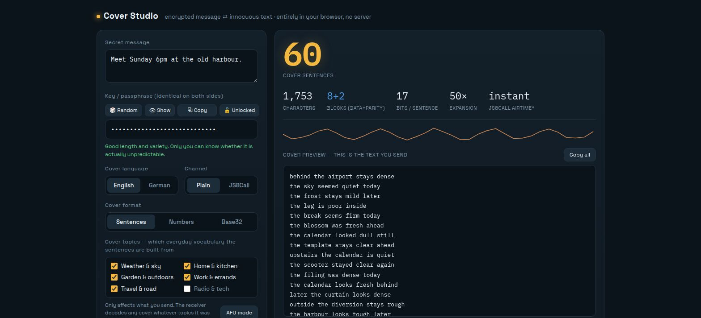
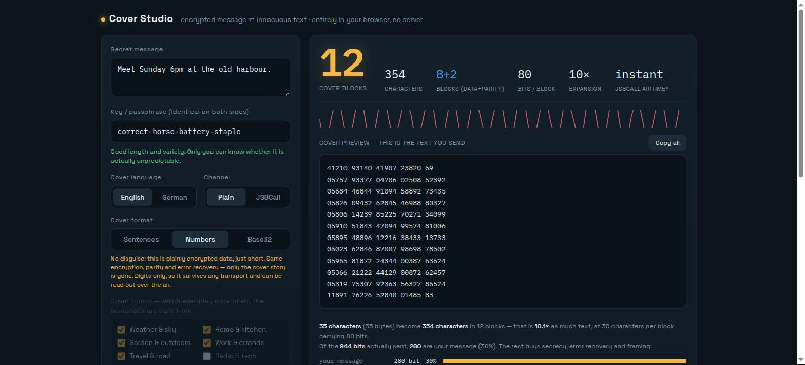

**English** · [Deutsch](README.de.md)

# StegoComm

[](https://github.com/TechnikWeber/StegoComm/actions/workflows/ci.yml)

**A proof-of-concept covert, encrypted messaging channel that hides ciphertext inside innocuous-looking chatter.**

Two interoperable implementations that speak the exact same wire format:

| Component | What it is | Dependencies |
|---|---|---|
| `cover_studio.html` | Browser tool (GUI): encode **and** decode, entirely client-side | **none** — just open the file |
| `stegocomms.py` | Python CLI engine, byte-compatible with the browser tool | `cryptography` |

A message encoded in the browser can be decoded by the Python CLI and vice versa.



*Left: what you type and how the cover is built. Right: the cover to send, with a
live count of how much it inflates your message.*



*The same message with the disguise switched off — 354 characters instead of
1753, and a plain warning that this no longer hides anything.*

> ⚠️ **This is a proof of concept, not audited security software.** It demonstrates the architecture (real AEAD encryption inside a steganographic text cover with forward error correction). Do not rely on it for protecting people at risk without an independent security review.

---

## How it works

Five steps down, the same five back up. Only the last one is unusual — the first
four are ordinary, well-understood cryptography.

```
        WHAT YOU TYPE
        "Meet Sunday 6pm at the old harbour"
                     │
                     │   1.  SQUEEZE
                     │       deflate, but only if it actually shrinks
                     ▼
        ▒▒▒▒▒▒▒▒▒▒▒▒▒▒▒▒▒▒
                     │
                     │   2.  LOCK
                     │       AES-256-GCM, key from your passphrase
                     │       (PBKDF2, 200 000 rounds)
                     ▼
        ████████████████████████    ← unreadable noise.
                     │                 THIS is what protects you
                     │
                     │   3.  SLICE
                     │       into 8-byte blocks
                     ▼
        ██ ██ ██ ██ ██ ██
                     │
                     │   4.  INSURE
                     │       add parity blocks (Reed-Solomon)
                     ▼
        ██ ██ ██ ██ ██ ██ ▓▓ ▓▓     ▓ = parity: any 2 lost blocks
                     │                  can be rebuilt without a resend
                     │
                     │   5.  DISGUISE
                     │       each block becomes sentences —
                     ▼       the CHOICE OF WORDS carries the bits
        ┌──────────────────────────────────┐
        │  the market is quiet today       │   ← this is what you send
        │  the roof is fine inside         │
        │  the antenna is steady here      │
        │  ...                             │
        └──────────────────────────────────┘

        The receiver runs the same five steps backwards.
```

**Why the choice of words is the data.** Each sentence follows one pattern, and
every slot in it has a fixed list of possible words. With 32 nouns to choose
from, *which* noun appears is worth 5 bits. Pick a noun, an adjective and an
ending, and one short sentence has carried 10 to 28 bits. The receiver looks up
each word's position in the same lists and gets the bits straight back.

| Layer | Solves |
|---|---|
| deflate (when it helps) | fewer bytes to hide |
| AES-256-GCM | nobody can read it, and tampering is detected |
| Reed-Solomon | lost blocks rebuilt without asking for a resend |
| the grammar | it does not look like a message |
| random padding | filler bits do not repeat a tell-tale pattern |

**The important bit:** your security comes from step 2, not step 5. Even someone
who knows exactly how this tool works and unpicks the sentences perfectly ends up
with the noise from step 2 — and without your passphrase that is where they stop.
The disguise buys you that nobody looks in the first place.

---

## What it does in detail

There is **no plaintext header anywhere in the cover**. The block index and its
CRC travel inside the sentence bits; the per-message constants live in a
**manifest** made of ordinary cover sentences, masked with a key-derived
keystream and therefore indistinguishable from a payload block. It is sent twice,
once at each end, so losing one spot does not cost you the message.

The cover is **nothing but carrier sentences**, in **letters and single spaces
only** — no punctuation, no digits, at any level, because punctuation is what a
radio or chat path quietly drops or substitutes. The `plain` profile (default) is
lower case, `js8call` upper case for JS8Call's most efficient character set;
casing carries no data.

The receiver reverses everything; a per-block CRC detects damaged blocks and
treats them as erasures, which parity repairs up to its limit — beyond that you
get a **NACK** listing exactly which blocks to resend (selective-repeat ARQ).

### Compact formats — when you do not need a disguise

If the channel is already private and only size matters, the sentences are pure
waste: **`--format digits` and `--format base32` render the same wire format in a
shorter alphabet.**

| Format | Same message | Alphabet | Bits per character |
|---|---|---|---|
| `sentences` (default) | 889 chars | words | 0.5 – 0.9 |
| `digits` | 263 chars | `0`–`9` | 3.3 |
| `base32` | 175 chars | Crockford's, upper case | 5 |

Four to six times shorter, and you lose exactly one thing: **the disguise.**
Everything else is untouched — same encryption, same parity, same CRC, same
manifest, same NACK. `digits` survives any transport and can be read out over the
air; `base32` uses Crockford's alphabet (no I, L, O, U) and is the shortest. The
decoder recognises all three formats by itself, so one side can send sentences
and the other digits with no agreement beyond the passphrase.

```
04037 82089 24965 64789 15437     ← digits
9S5EW 5K71F HD248                 ← base32
```

### Cover topics

The sentences are built from six everyday vocabularies — **weather & sky, home &
kitchen, garden & outdoors, work & errands, travel & road, radio & tech**, 64
nouns each — drawn per sentence, so a cover wanders between subjects the way real
chatter does. Everything but *radio & tech* is on by default; **AFU mode**
switches to *radio & tech* alone for amateur-radio use.

**The selection is sender-side only, and the two sides never have to match it.**
Every noun is unique across all topics, so the noun itself tells the decoder which
topic a sentence came from — the test suite proves it by encoding with a different
topic set in each implementation. On the command line: `--topics weather,garden`
or `--afu`.

### Surviving the transport

The decoder does not read lines at all — it reads **one continuous stream of
words**. Every sentence pattern has a fixed word count, so **line breaks carry no
information**: a path that wraps, joins or reflows the text changes nothing.
Before parsing it folds away casing, a leading callsign or quote marker
(`KN4CRD: `, `> `), punctuation and runs of whitespace — and if characters remain
that the grammar never produces, it says so rather than blaming your passphrase.
What stays fatal is a path that **changes or drops words**: each damaged sentence
costs one block, parity absorbs a few, and beyond that you get a NACK.

### The believability slider

**"Level" is the position of the believability slider** — four settings, `--level
0` to `--level 3`. A low level uses only the most everyday words and needs many
sentences; a high level draws on much wider lists, so one sentence carries more.
Nothing else changes: you are trading how natural the text reads against how long
it is. The receiver does not need to be told which level you used.

Measured on `Treffen Sonntag 18 Uhr am alten Hafen` (German, 2 parity blocks):

| Level | Feel | Bits/sentence | Words drawn from | Sentences | Characters | Example |
|---|---|---|---|---|---|---|
| 0 | very believable | 14 | 16 nouns, 8+8 others | 78 | 2186 | `jetzt war die karte laut` |
| 1 | believable (default) | 17 | 32 nouns, 16+16 | 65 | 1920 | `oben blieb der drucker mau` |
| 2 | terse | 23 | 64 nouns, 32+16+16 | 52 | 1630 | `abends war regen hart hell` |
| 3 | very terse | 26 | 64 nouns, 64+32+32 | 50 | 1422 | `heil diesig prognose wiederholt` |

Naturalness falls in a way you can hear: levels 0 and 1 are complete sentences
with an article and a verb, level 2 drops the article, level 3 drops the verb as
well. This ladder was **measured, not guessed** — cover length is
`ceil(80 / bits) × average sentence length`, so the terse levels shed function
words and widen the word lists (8/16/32 options per slot) instead of adding
clauses. Believability falls while the character count does too, which on JS8Call,
where airtime tracks characters, genuinely halves transmission time.

Each level offers **sixteen sentence shapes** of identical word count and bit
width; which one is used is itself part of the payload, so the variety is free.
Neither the language nor the level is stored anywhere — the decoder tries all 8
(language, level) combinations and lets the manifest's CRC16 decide.

---

## Install

**Browser tool — nothing to install.** Just open `cover_studio.html`:

```bash
xdg-open cover_studio.html        # Linux
# or double-click it, or bookmark file:///path/to/cover_studio.html
```

**Python CLI** needs Python 3.8+ and the `cryptography` package. The robust, cross-distro way is a virtual environment:

```bash
cd StegoComm
python3 -m venv .venv
source .venv/bin/activate          # Windows: .venv\Scripts\activate
pip install -r requirements.txt
```

On Fedora you may instead use the system package: `sudo dnf install python3-cryptography`.
(A bare `pip install --user cryptography` also works unless your distro reports `externally-managed-environment` — then use the venv above.)

## Usage

**Browser:** type your message, enter a key (both sides must use the same one),
pick language / channel / believability, then **Copy all**. The other side pastes
it into the *Receive & decrypt* panel and clicks **Decrypt**. **Test with my own
cover** is a loopback check: it decodes the cover you just generated, so you can
confirm encode and decode agree without a second machine.

Four buttons sit above the key field:

- **🎲 Random** replaces the key with 25 characters from `crypto.getRandomValues`
  — 125 bits, from an alphabet without the look-alikes `l/1` and `o/0`, so it
  survives being read out over the air.
- **👁 Show** reveals the key, which is **masked by default** so a screenshot or a
  glance over your shoulder does not hand it over.
- **⧉ Copy** puts it on the clipboard, masked or not.
- **🔒 The padlock** makes the field read-only and greys out the dice, so a stray
  keystroke cannot silently change the key both sides agreed on.

Nothing is stored — close the tab and the key is gone. Write it down before you
send anything.

**CLI:**

```bash
# self-test (round-trip + parity recovery + NACK + transport damage)
python3 stegocomms.py selftest

# encode a message to cover text (plain lower case is the default)
python3 stegocomms.py encode --pass "your-shared-passphrase" --lang en --level 1 \
        "Meet Sunday 6pm at the old harbour"

# ... in upper case for JS8Call
python3 stegocomms.py encode --pass "your-shared-passphrase" --profile js8call \
        --lang en --level 1 "Meet Sunday 6pm at the old harbour"

# ... drawing only on chosen vocabularies, or on radio & tech alone
python3 stegocomms.py encode --pass "..." --topics weather,garden "..."
python3 stegocomms.py encode --pass "..." --afu --profile js8call "..."

# ... or with no disguise at all, 4-6x shorter
python3 stegocomms.py encode --pass "..." --format digits "..."
python3 stegocomms.py encode --pass "..." --format base32 "..."

# decode cover text from stdin
python3 stegocomms.py decode --pass "your-shared-passphrase"    # paste, then Ctrl-D
```

**Cross-check browser ⇄ Python** (prove interop): encode in one, decode in the
other with the same passphrase. If the plaintext comes back, the two independent
implementations agree.

### About the passphrase

Any UTF-8 text works — PBKDF2 turns whatever you type into a 32-byte key. But
since the entire security of the tool hangs on this one string, both sides
**refuse to encode below 12 characters** and tell you when what you typed is
weaker than it looks. (`--allow-weak-pass` overrides the CLI check; decoding is
never restricted, or you could not read your own old messages.)

**What a good passphrase looks like:** four or five unrelated words, e.g.
`harbour-lantern-quiet-seven`, or the browser tool's 🎲 Random key. Length beyond
that matters less than unpredictability — `aaaaaaaaaaaaaaaaaaaa` is twenty
characters and worthless. The check reports what is actually checkable (length,
variety, whether it is a single word); no meter can tell whether *you* picked it
at random, and it says so.

**Nothing is trimmed:** `"secret"` and `"secret "` are different keys, so a stray
space picked up while copying will break decryption.

---

## Sending over JS8Call

> ⚠️ **Encryption and obscured transmissions are not permitted in amateur radio.**
> Amateur service rules require the content of a transmission to be in the clear
> and intelligible to anyone listening — encrypting it or hiding it in innocuous
> chatter is exactly what they forbid. The details are set by each country's own
> administration (in Germany the Amateurfunkverordnung, in the US FCC Part 97,
> elsewhere the national equivalent), so **check the regulations that apply to
> you before putting this on the air.** On the amateur bands, treat this tool as
> a demonstration; over chat, e-mail or other non-amateur paths the restriction
> does not apply.

**Paste only the cover sentences. Nothing else.** JS8Call puts your own callsign
on the air itself — you type message text, not a header. Do not prepend `DE
<call>`, and never send a callsign that is not yours: that is illegal wherever
amateur radio is licensed.

1. Encode with `--profile js8call` (upper case) or the **JS8Call** channel in the
   browser tool.
2. Copy the whole cover.
3. Paste it into JS8Call's send box and transmit. Long covers exceed one frame;
   JS8Call splits them, or you send them in chunks.
4. The receiver copies the received text out of JS8Call and pastes it into
   `decode`. Callsign prefixes and line breaks are handled automatically.

---

## Wire format v5

The grammar contains no punctuation at all, and the decoder reads a stream of
words rather than lines. Each level carries sixteen sentence shapes and the
sentences are drawn from six topic vocabularies — neither of which the receiver
has to be told. Deflate is applied only when it actually shrinks the message, so
the manifest records which was used. The salt is `stegocomm/v5/pbkdf2`; **covers
from earlier versions cannot be decoded.**

```
plaintext → deflate → AES-256-GCM(iv‖ciphertext‖tag)
          → 8-byte data blocks (+ R Cauchy/Reed-Solomon parity blocks)
          → per block: idx‖payload‖CRC8 (80 bits), masked with a keystream
          → cover sentences (variable density) + one manifest run at each end
          → spare bits filled with key-derived random padding
```

Because there are no header lines to re-synchronise on, the decoder slides a
window over the word stream: it reads *n* sentences, checks the block CRC, and on
failure advances by a single **word**. A dropped or mangled sentence therefore
costs one block, not the rest of the message.

### Known limits

- A message is capped at 254 blocks, i.e. roughly 2 kB of ciphertext.
- A cover is 40× to 70× the length of the message. Most of that is inherent — the
  grammar carries 0.4 to 0.8 bits per character. Larger blocks were measured and
  rejected: parity grows with block size, so 8 bytes gave the smallest cover at
  every message length tried.
- The sentences are template-generated and pair words at random, so odd
  combinations occur. It reads as chatter, not as prose.
- Block detection rests on an 8-bit CRC, so a random sentence run has a ~1/256
  chance of being mistaken for a block. The GCM tag then rejects the message
  rather than returning wrong plaintext.

---

## Running the tests

The two implementations must agree byte for byte, so the cross-check is the part
that matters — a change to only one of them fails here. It runs on every push via
GitHub Actions, and locally with:

```bash
./tests/run_all.sh
```

It runs each engine's own selftest (round-trip, parity recovery, NACK, manifest
redundancy, resynchronisation, transport damage, grammar consistency), then
encodes with each implementation and decodes with the other across all levels,
languages and profiles — each case with a *different* topic selection, so a topic
leaking into the bit layout would fail the build. Finally it checks that the word
lists and the passphrase rule are identical on both sides. `tests/engine.mjs`
loads the browser engine straight out of `cover_studio.html`, so the tested code
is the shipped code.

---

## License

MIT — see [LICENSE](LICENSE).

---

## Security notes

- **Point-to-point, not end-to-end by itself:** the passphrase protects the message content between the two people who share it. Choose a strong, shared-out-of-band passphrase.
- **Everything hangs on that passphrase.** There is no key exchange and no forward secrecy: whoever obtains it later can read every message they ever intercepted.
- **No sender authentication.** Anyone holding the key can also send. Two people sharing a key are indistinguishable to each other.
- **No replay protection.** An intercepted cover can be replayed later.
- **The cover hides *content and the fact that content exists*, but not necessarily *that two parties communicate*.** Metadata (who talks to whom, when, how much) is a separate problem.
- **The disguise does not survive statistical scrutiny.** Every sentence at a level follows one template, so a long cover is conspicuously repetitive. It works against a casual reader, not against someone looking for it.
- **Not audited.** Proof of concept. No warranty.
- **Legal:** amateur radio does not allow encrypted or obscured transmissions.
  What is permitted depends on your national regulations — check them before
  transmitting. See [Sending over JS8Call](#sending-over-js8call).
